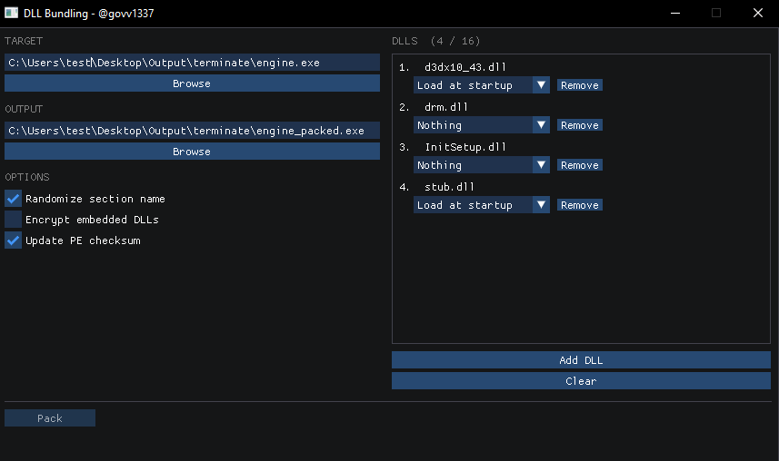

# DLL Bundling

*by @govv1337*

Stuffs one or more DLLs inside an EXE so they load automatically when it runs. No extra files, no side-by-side DLLs, nothing to ship alongside it.



---

## What it does

The packer takes your EXE and your DLLs and merges them into a single file. It does this by adding a new section called `.bndl` to the EXE that holds a small loader (~1.5 KB of raw machine code) and the raw bytes of every DLL you added.

Then it patches the entry point. The first 5 bytes of the EXE's original entry point get overwritten with a `JMP` that redirects execution to the loader. When the EXE launches, the loader runs first, maps the DLLs into memory, then jumps to where the original entry point was. From there the EXE runs exactly as normal.

The section layout looks like this:

```
+-----------------------------+
| BUNDLE_HEADER               |  <- magic, OEP rva, dll count, xor key, slot table
+-----------------------------+
| Loader stub (~1.5 KB)       |  <- position-independent machine code, no imports
+-----------------------------+
| DLL #0 raw bytes            |
+-----------------------------+
| DLL #1 raw bytes            |
+-----------------------------+
| ...                         |
+-----------------------------+
```

---

## Runtime breakdown

When the packed EXE starts:

1. Windows loads it as normal, nothing unusual happens yet
2. Execution hits the patched entry point and jumps into the stub
3. The stub reads the actual image base from the PEB at `gs:[0x60]` — this is why ASLR doesn't cause problems, the address is always correct regardless of where Windows loaded it
4. It walks the PEB loader list to find `kernel32.dll` without using any imports
5. It resolves `VirtualAlloc`, `VirtualProtect`, `LoadLibraryA`, `GetProcAddress` by parsing kernel32's export table directly
6. It scans the section table looking for a section whose first 4 bytes are the `BNDL` magic (`0x4C444E42`) — this is how it finds the bundle regardless of what the section is named
7. It reads the header and loops over the DLL slots

For each DLL set to **Load at startup**:

- If the DLL is encrypted: allocates a temporary RW buffer with `VirtualAlloc`, XORs every byte back using the key stored in the header, then loads from that buffer
- Allocates memory for the DLL, tries the DLL's preferred base first, falls back to anywhere if it's taken
- Copies the PE headers and all sections into the allocation
- Applies `IMAGE_REL_BASED_DIR64` relocations if the DLL didn't land at its preferred base
- Walks the import descriptor table, finds each dependency via PEB walk or `LoadLibraryA`, resolves each function with `GetProcAddress`
- Sets correct page protections per section (RX for code, RW for data, etc.)
- Calls `DllMain(base, DLL_PROCESS_ATTACH, NULL)`

After all DLLs are initialized, it jumps to `image_base + oep_rva`. The EXE runs from here as if nothing happened.

The whole stub runs in under a millisecond. No threads, no hooks, no timing differences. After the jump to OEP it's completely gone from the call stack.

---

## Options

### Randomize section name

Gives the `.bndl` section a random name like `.fqzwlmia` instead. Since the stub finds the section by magic rather than name, this works transparently at runtime. Makes it slightly less obvious what tool was used.

> Requires the updated stub in `stub/stub.cpp` to be compiled and `stub_bytes.h` updated — the old stub searches by section name and won't find it.

### Encrypt embedded DLLs

XORs each DLL's bytes with a random 32-bit key before writing them into the section. The key is stored in the `BUNDLE_HEADER`. Anyone opening the packed EXE in a hex editor or PE tool just sees garbage where the DLL bytes are. The stub allocates a temp buffer, decrypts into it, then maps from there.

The XOR is applied as 4 rotating bytes — byte at offset `j` gets XOR'd with `(key >> ((j & 3) * 8)) & 0xFF`.

> Requires the updated stub in `stub/stub.cpp` to be compiled and `stub_bytes.h` updated — the old stub has no decryption logic.

### Update PE checksum

The PE optional header has a `CheckSum` field. The packer zeroes it, sums all 16-bit words in the file with carry folding, adds the file size, and writes the result back. Most loaders and programs don't care about this field but some AV and DRM tools do check it, and a mismatched checksum on a modified executable can be a flag.

> No stub changes needed for this one.

---

## DLL modes

You set a mode per DLL in the UI.

**Load at startup** — the stub maps and initializes the DLL before the original entry point runs. The EXE doesn't need to do anything.

**Nothing** — the DLL bytes are still embedded in the section but the stub skips the slot. Useful if you want to load the DLL yourself at a specific point from inside the EXE. The raw bytes are at `bndl_section_base + slot.offset`, real size is `slot.size & 0x7FFFFFFF` (bit 31 is the mode flag).

---

## Usage

1. Open `BundlingDLL.sln`, build **Release | x64**
2. Launch `BundlingDLL.exe`
3. Select the target EXE — output path fills in automatically
4. Add DLLs, set a mode for each
5. Tick any options you want
6. Click **Pack**

---

## Notes

- Pack **after** obfuscating. The packer reads whatever entry point the EXE currently has. If you obfuscate after packing, the obfuscator may overwrite the `JMP` patch.
- x64 only. 32-bit PEs are not supported.
- No admin rights needed.
- If you need to modify the stub, edit `stub/stub.cpp`, recompile it as a standalone Release x64 binary with `/NODEFAULTLIB` and `/ENTRY:stub_main`, extract the `.text` section bytes, and put them in `packer/stub_bytes.h` as a byte array. Until you do this the packer embeds whatever bytes were there last time someone extracted them.

---

## Structure

```
DLL_Packing/
├── BundlingDLL/
│   ├── main.cpp              # WinMain, DX11 device, message loop
│   ├── gui/
│   │   ├── gui.cpp           # UI: file picker, DLL list, options, pack button
│   │   └── imgui/
│   └── packer/
│       ├── packer.cpp        # PE parsing, section building, OEP patch, options
│       ├── packer.h
│       └── stub_bytes.h      # Compiled stub bytes — regenerate if stub.cpp changes
└── stub/
    └── stub.cpp              # The actual loader — no CRT, no imports, position-independent
```
